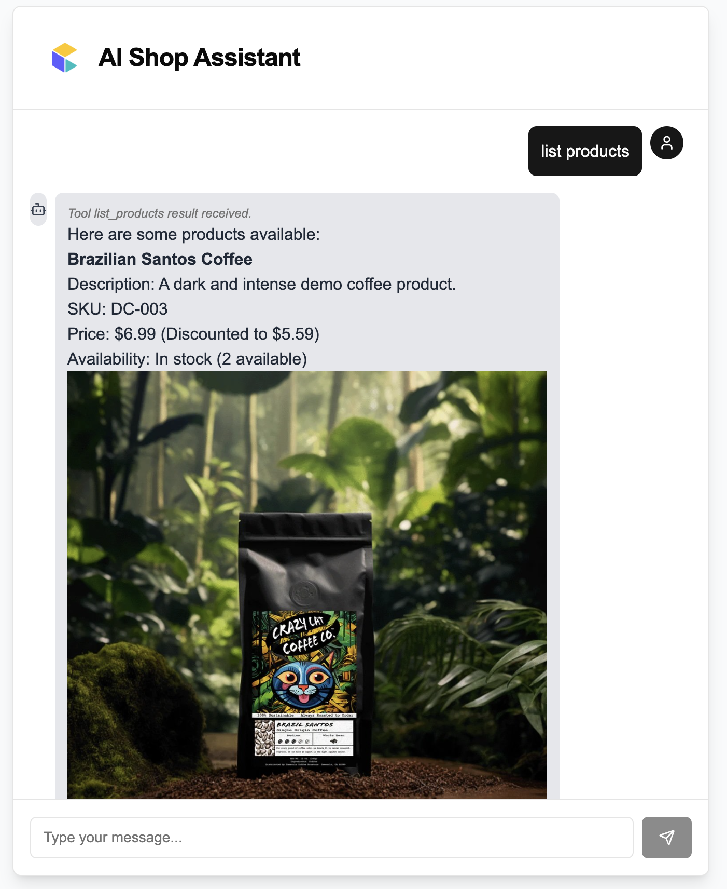

[](https://vercel.com/new/clone?repository-url=https%3A%2F%2Fgithub.com%2Flgiavedoni%2Fai-shopping-assistant-ct&env=OPENAI_API_KEY,PROJECT_KEY,CLIENT_SECRET,CLIENT_ID,AUTH_URL,API_URL)

# AI Shopping Assistant for commercetools

This project provides a template for building an AI-powered shopping assistant that connects to a commercetools project.

It uses the Vercel AI SDK for language model interaction and UI components, and commercetools MCP Essentials to allow the AI to interact with the commercetools API via tool calling (MCP).

## Demo




## Technologies Used

*   [Next.js](https://nextjs.org/) - React framework for building the application.
*   [Vercel AI SDK Core (`ai`)](https://sdk.vercel.ai/docs) - For backend AI interactions, streaming, and tool handling.
*   [Vercel AI SDK UI (`@ai-sdk/react`)](https://sdk.vercel.ai/docs/ai-sdk-ui) - For frontend chat components (`useChat` hook).
*   [commercetools MCP Essentials (`@commercetools/mcp-essentials`)](https://github.com/commercetools/mcp-essentials) - Provides MCP tools to interact with commercetools APIs (products, carts, orders, etc.).
*   [OpenAI](https://openai.com/) - The language model used for the assistant (specifically GPT-4o in this template).
*   [shadcn/ui](https://ui.shadcn.com/) - UI components for the chat interface.
*   [Tailwind CSS](https://tailwindcss.com/) - For styling.

## Getting Started

### Prerequisites

*   Node.js and npm/yarn/pnpm installed.
*   A commercetools project with API client credentials.
*   An OpenAI API key.

### Installation

1.  Clone the repository:
    ```bash
    git clone <your-repo-url>
    cd <your-repo-directory>
    ```
2.  Install dependencies:
    ```bash
    npm install
    # or
    yarn install
    # or
    pnpm install
    ```

### Environment Variables

Create a `.env.local` file in the root of the project and add your commercetools and OpenAI credentials.

You can obtain your commercetools API client credentials (Client ID, Client Secret, Project Key, Auth URL, API URL) from the commercetools Merchant Center under **Settings > Developer settings**. Follow the instructions here: [Create an API Client](https://docs.commercetools.com/getting-started/create-api-client).

```env
# commercetools API Credentials
CLIENT_ID='YOUR_CTP_CLIENT_ID'
CLIENT_SECRET='YOUR_CTP_CLIENT_SECRET'
PROJECT_KEY='YOUR_CTP_PROJECT_KEY'
AUTH_URL='YOUR_CTP_AUTH_URL' # e.g., https://auth.europe-west1.gcp.commercetools.com
API_URL='YOUR_CTP_API_URL'   # e.g., https://api.europe-west1.gcp.commercetools.com

# OpenAI API Key
OPENAI_API_KEY='YOUR_OPENAI_API_KEY'
```

Replace the placeholder values with your actual credentials.

### Running the Development Server

```bash
npm run dev
# or
yarn dev
# or
pnpm dev
```

Open [http://localhost:3000](http://localhost:3000) in your browser to see the application.

## Key Components

*   **`app/api/chat/route.ts`**: The backend API route that handles chat requests. It initializes the Vercel AI SDK and commercetools MCP Essentials, configures the AI model (OpenAI GPT-4o), defines the system prompt, sets up the available commercetools tools, and uses `streamText` to process messages and handle tool calls.
*   **`app/page.tsx`**: The frontend chat interface. It uses the `useChat` hook from `@ai-sdk/react` to manage chat state, render messages (including text and tool invocation status), and handle user input.

## How it Works

1.  The user types a message in the chat interface (`app/page.tsx`).
2.  The `useChat` hook sends the message history to the backend API route (`app/api/chat/route.ts`).
3.  The backend uses the Vercel AI SDK's `streamText` function with the OpenAI model and the commercetools tools.
4.  The AI determines if it needs to use a commercetools tool (like searching for products or managing a cart) based on the user's request and the available tools.
5.  If a tool is needed, the AI SDK calls the corresponding tool provided by commercetools MCP Essentials.
6.  The toolkit function makes the API call to commercetools using the provided credentials.
7.  The results from the tool (or an error) are sent back to the AI model.
8.  The AI model generates a response for the user based on the tool results or its own knowledge.
9.  The response is streamed back to the frontend and displayed in the chat interface.
